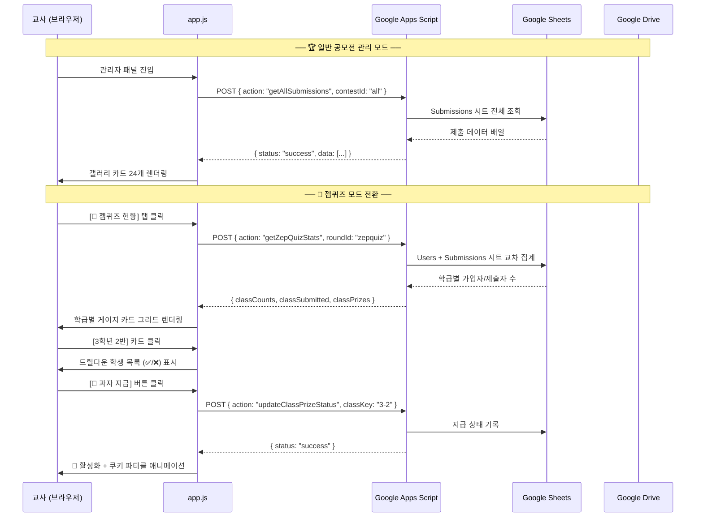

# 🏗️ SORO 듀얼 모드 관리자 대시보드 개발 계획서

> **문서 버전**: v1.0 | **작성일**: 2026. 06. 10.  
> **대상 브랜치**: `quiz`  
> **아키텍처 원칙**: 100% Cloud-Only (localStorage 폴백 전면 제거)

---

## 1. 프로젝트 개요

### 1.1 배경
SORO 포털의 관리자(교사) 대시보드를 **일반 공모전 관리**와 **젭퀴즈 달성 현황 모니터링**이라는 두 가지 완전히 다른 업무 목표를 하나의 화면에서 효율적으로 전환하며 수행할 수 있는 **듀얼 모드 대시보드**로 전면 재설계합니다.

### 1.2 핵심 목표
| 목표 | 설명 |
| :--- | :--- |
| **듀얼 모드 탭 전환** | 일반 공모전 관리 모드와 젭퀴즈 모니터링 모드를 하나의 대시보드 내에서 탭으로 전환 |
| **Cloud-Only 아키텍처** | 모든 데이터의 조회/저장/삭제를 100% 구글 시트 API로 처리하고 localStorage 폴백 전면 제거 |
| **제출 이중 방지** | 업로드 중 버튼 비활성화 및 로딩 안내로 중복 제출 원천 차단 |
| **학급별 드릴다운 뷰** | 젭퀴즈 탭에서 학급별 진행률 요약 → 클릭 시 해당 반 학생 상세 현황 펼침 |
| **드라이브 폴더 격리** | 젭퀴즈 스크린샷은 `SORO_ZepQuizzes/[퀴즈ID]` 전용 폴더에 자동 분류 저장 |

---

## 2. 현행 대시보드 진단 (As-Is)

### 2.1 현재 관리자 화면 구조

```
┌─────────────────────────────────────────────────────────────┐
│ [admin-drawer]                                              │
│ ┌───────────┐ ┌───────────────────────────────────────────┐ │
│ │ 좌측       │ │ 우측 메인 패널                             │ │
│ │ 사이드바    │ │                                           │ │
│ │           │ │ ┌───────────────────────────────────────┐ │ │
│ │ KPI 카드   │ │ │ 공모전 제어 카드 패널 (6개 카드 그리드)   │ │ │
│ │ ·총 제출   │ │ │ [키링][컷툰][도서관][필사][픽셀][사진]   │ │ │
│ │ ·참가학생  │ │ └───────────────────────────────────────┘ │ │
│ │ ·심사후보  │ │ ┌───────────────────────────────────────┐ │ │
│ │ ·사은품    │ │ │ 필터 바 (별표/사은품/학년/반/검색/엑셀)  │ │ │
│ │           │ │ └───────────────────────────────────────┘ │ │
│ │ ─────────  │ │ ┌───────────────────────────────────────┐ │ │
│ │ 학년별     │ │ │ 제출작 갤러리 그리드                     │ │ │
│ │ 참여 현황  │ │ │ (전체 카드 무제한 DOM 렌더링)            │ │ │
│ │ (3~6학년)  │ │ │                                       │ │ │
│ │           │ │ └───────────────────────────────────────┘ │ │
│ │ [동기화]   │ │                                           │ │
│ └───────────┘ └───────────────────────────────────────────┘ │
└─────────────────────────────────────────────────────────────┘
```

### 2.2 진단된 주요 문제점

| # | 문제 | 심각도 | 설명 |
| :--- | :--- | :---: | :--- |
| P1 | 공모전 제어 패널 공간 낭비 | 🔴 높음 | 상단 6개 제어 카드가 메인 화면의 ~40%를 차지하여 가장 중요한 제출작 갤러리를 아래로 밀어냄. 교사가 가장 자주 쓰는 기능(제출물 확인)에 즉시 접근 불가 |
| P2 | 필터 바 과밀 | 🟡 중간 | 별표/사은품/학년/반/검색/엑셀 버튼이 한 행에 밀집. 태블릿 세로 화면에서 줄바꿈으로 레이아웃 붕괴 |
| P3 | 사이드바 통계 비연동 | 🟡 중간 | 좌측 학년별 통계 바 클릭 시 우측 갤러리가 필터링되지 않는 단절된 인터랙션 |
| P4 | DOM 무제한 렌더링 | 🔴 높음 | 전체 제출 데이터를 한 번에 DOM에 그려 저사양 크롬북/태블릿에서 프리징 유발 |
| P5 | 젭퀴즈 지원 부재 | 🔴 높음 | 학급별 달성률 모니터링, 과자 세트 단체 지급 기능 부재 |
| P6 | 로컬 저장소 의존 | 🟡 중간 | 별표, 사은품 상태, 접수 제어 잠금 등이 localStorage에 의존하여 브라우저 교체 시 데이터 유실 |

---

## 3. 목표 대시보드 설계 (To-Be)

### 3.1 전체 레이아웃 구조

```
┌──────────────────────────────────────────────────────────────────┐
│ ┌──────────┐ ┌─────────────────────────────────────────────────┐ │
│ │ 좌측      │ │ 우측 메인 패널                                   │ │
│ │ 사이드바   │ │                                                 │ │
│ │          │ │ ┌───────────────────────────────────────────┐   │ │
│ │ (탭 전환에 │ │ │ [🏆 일반 공모전 관리] [🍪 젭퀴즈 현황]  [⚙️] │   │ │
│ │  따라     │ │ └───────────────────────────────────────────┘   │ │
│ │  KPI 교체) │ │                                                 │ │
│ │          │ │  ── 🏆 일반 공모전 모드 ──                        │ │
│ │ ┌────────┐│ │ ┌─────────────────────────────────────────────┐ │ │
│ │ │KPI 블록 ││ │ │ 검색창 (상단 넓게) + [상세 필터 ▾] 접기     │ │ │
│ │ │ 모드별  ││ │ └─────────────────────────────────────────────┘ │ │
│ │ │ 동적교체 ││ │ ┌─────────────────────────────────────────────┐ │ │
│ │ └────────┘│ │ │ 제출작 갤러리 (24개씩 점진적 렌더링)         │ │ │
│ │ ─────────  │ │ │       [더보기 ▾] 버튼                        │ │ │
│ │ 학년별     │ │ └─────────────────────────────────────────────┘ │ │
│ │ 인터랙티브 │ │                                                 │ │
│ │ 통계      │ │  ── 🍪 젭퀴즈 모드 ──                           │ │
│ │ (클릭→    │ │ ┌─────────────────────────────────────────────┐ │ │
│ │  필터연동) │ │ │ [회차 선택: 6월 저작권 퀴즈 ▾]              │ │ │
│ │          │ │ └─────────────────────────────────────────────┘ │ │
│ │ [동기화]  │ │ ┌─────────────────────────────────────────────┐ │ │
│ │          │ │ │ 학급별 게이지 카드 그리드                     │ │ │
│ │          │ │ │ ┌──────┐ ┌──────┐ ┌──────┐                  │ │ │
│ │          │ │ │ │3-1   │ │3-2   │ │3-3   │  ...             │ │ │
│ │          │ │ │ │██░░░ │ │█████ │ │███░░ │                  │ │ │
│ │          │ │ │ │60%   │ │100%🍪│ │72%   │                  │ │ │
│ │          │ │ │ └──────┘ └──────┘ └──────┘                  │ │ │
│ │          │ │ │                                             │ │ │
│ │          │ │ │ ▼ [3학년 2반] 드릴다운 학생 현황             │ │ │
│ │          │ │ │ ✅ 김소로 ┃ ✅ 박하늘 ┃ ❌ 이별 (미제출)    │ │ │
│ │          │ │ └─────────────────────────────────────────────┘ │ │
│ └──────────┘ └─────────────────────────────────────────────────┘ │
└──────────────────────────────────────────────────────────────────┘
```

### 3.2 듀얼 모드 탭 전환 시 변경 요소

| 화면 영역 | 🏆 일반 공모전 모드 | 🍪 젭퀴즈 모드 |
| :--- | :--- | :--- |
| **사이드바 KPI** | 총 제출작 / 참가 학생 / 심사 후보 / 사은품 지급 | 전교 참여율 / 달성 학급 수 / 미달성 학급 수 / 과자 지급 완료 |
| **사이드바 통계** | 학년별 참여 비율 바 (클릭 → 갤러리 필터링) | 학년별 달성률 바 (클릭 → 해당 학년 학급만 표시) |
| **메인 헤더** | 검색창 + [상세 필터 ▾] + Excel 추출 | [회차 선택 ▾] + 검색 |
| **메인 콘텐츠** | 학생별 제출작 이미지/오디오 갤러리 카드 | 학급별 진행률 게이지 카드 그리드 |
| **상세 조회** | 카드 클릭 → 이미지 모달 | 학급 카드 클릭 → 해당 반 학생 목록 드릴다운 |
| **보상 단위** | 개인 사은품 토글 (🎁) | 학급 단체 과자 토글 (🍪) |
| **테마 악센트** | 네온 퍼플/블루 (`#8b5cf6` ~ `#3b82f6`) | 따뜻한 앰버/골드 (`#d97706` ~ `#f59e0b`) |

---

## 4. 파일별 상세 수정 명세

### 4.1 [MODIFY] `index.html`

#### 4.1.1 듀얼 모드 탭 마크업 추가
- `admin-main-header` 영역에 두 개의 메인 탭 버튼을 삽입합니다.

```html
<!-- 듀얼 모드 탭 -->
<div class="admin-mode-tabs">
  <button id="admin-tab-contest" class="admin-mode-tab active"
          onclick="switchAdminMode('contest')">
    🏆 일반 공모전 관리
  </button>
  <button id="admin-tab-zepquiz" class="admin-mode-tab"
          onclick="switchAdminMode('zepquiz')">
    🍪 젭퀴즈 달성 현황
  </button>
</div>
```

#### 4.1.2 공모전 제어 패널 재배치
- 현재 상단 고정된 `admin-contest-cards` 6개 카드 영역을 기본 숨김 처리합니다.
- 상단 헤더의 **[⚙️]** 설정 버튼 클릭 시에만 슬라이드다운 또는 모달 형태로 노출되도록 구조를 변경합니다.

```html
<!-- 변경 전: 항상 노출 -->
<div id="admin-contest-cards" class="admin-contest-grid">...</div>

<!-- 변경 후: 기본 숨김, 버튼으로 토글 -->
<button id="admin-settings-btn" class="admin-settings-btn" 
        onclick="toggleAdminSettingsPanel()">⚙️ 공모전 제어</button>
<div id="admin-contest-cards" class="admin-contest-grid" 
     style="display: none;">...</div>
```

#### 4.1.3 필터 바 간소화
- 학년 캡슐 버튼(`admin-grade-selector`)을 필터 바에서 제거하고, 사이드바 통계 클릭으로 대체합니다.
- 별표/사은품/반 필터를 **[상세 필터 ▾]** 아코디언 내부로 이동합니다.
- 검색창을 필터 바 최상단에 넓게 배치합니다.

#### 4.1.4 젭퀴즈 전용 섹션 마크업

```html
<!-- 젭퀴즈 대시보드 영역 (기본 숨김) -->
<div id="admin-zepquiz-section" style="display: none;">
  <!-- 회차 선택 -->
  <div class="zepquiz-round-selector">
    <select id="zepquiz-round-select">
      <option value="zepquiz">6월 저작권 퀴즈</option>
      <!-- 향후 회차 자동 추가 -->
    </select>
  </div>
  <!-- 학급별 게이지 카드 그리드 -->
  <div id="zepquiz-class-grid" class="zepquiz-class-grid">
    <!-- JS 동적 렌더링 -->
  </div>
  <!-- 드릴다운 학생 상세 영역 -->
  <div id="zepquiz-drilldown" class="zepquiz-drilldown" style="display: none;">
    <!-- JS 동적 렌더링 -->
  </div>
</div>
```

#### 4.1.5 사이드바 KPI 동적 교체 구조
- 기존 KPI 카드 래퍼에 `data-mode="contest"` / `data-mode="zepquiz"` 속성을 부여하여 탭 전환 시 보이는 KPI 블록을 교체합니다.

---

### 4.2 [MODIFY] `app.js`

#### 4.2.1 듀얼 모드 상태 관리

```javascript
// ── 신규 상태 변수 ──
let currentAdminMode = "contest"; // "contest" | "zepquiz"
let zepquizClassData = [];        // 학급별 집계 데이터
let zepquizCurrentRound = "zepquiz"; // 선택된 젭퀴즈 회차 ID

// ── 탭 전환 함수 ──
function switchAdminMode(mode) {
  currentAdminMode = mode;
  // 1. 탭 활성 상태 교체
  // 2. 사이드바 KPI 블록 교체
  // 3. 메인 콘텐츠 교체 (갤러리 vs 학급 그리드)
  // 4. 젭퀴즈 탭일 때만 API 호출 (Lazy Loading)
}
```

#### 4.2.2 제출 이중 방지 (Double Submit Prevention)

```javascript
// submitContest 함수 내부 - 버튼 비활성화 로직 추가
async function handleSubmitContest(e) {
  e.preventDefault();
  
  const submitBtn = document.getElementById("submit-btn");
  const originalText = submitBtn.textContent;
  
  // 즉시 비활성화
  submitBtn.disabled = true;
  submitBtn.textContent = "☁️ 클라우드에 접수 중...";
  submitBtn.classList.add("submitting");
  
  try {
    // ... 기존 클라우드 전송 로직 (localStorage 폴백 제거) ...
    
    const response = await fetch(GOOGLE_SHEET_API_URL, { ... });
    const result = await response.json();
    
    if (result.status === "error") {
      showToast(result.message, "error");
      return; // finally에서 버튼 복구
    }
    
    showToast("접수 완료!", "success");
    closeContestDrawer();
  } catch (err) {
    showToast("네트워크 연결이 지연되고 있습니다. 잠시 후 다시 시도해 주세요.", "error");
  } finally {
    // 항상 버튼 복구
    submitBtn.disabled = false;
    submitBtn.textContent = originalText;
    submitBtn.classList.remove("submitting");
  }
}
```

#### 4.2.3 localStorage 폴백 전면 제거 대상 목록

| 함수명 | 제거 대상 코드 | 대체 처리 |
| :--- | :--- | :--- |
| `handleSubmitContest` | `localStorage.setItem("soro_submissions", ...)` | 제거 (클라우드 성공 시 UI만 갱신) |
| `fetchAndRenderAdminData` | `localStorage.getItem("soro_submissions")` 폴백 | 네트워크 오류 표시 UI |
| `renderAdminKPIs` | `localStorage.getItem("soro_admin_stars")` | 클라우드 시트 데이터에서 직접 로드 |
| `toggleAdminPrize` | `localStorage.setItem("soro_admin_prizes", ...)` | API 응답 확인 후 UI 반영 |
| `toggleContestLock` | `localStorage.setItem("soro_contest_locks", ...)` | API 응답 확인 후 UI 반영 |
| `handleSignUp` | 로컬 가입 처리 경로 | 클라우드 API 전용 |
| `handleLogin` | 로컬 인증 경로 | 클라우드 API 전용 |

#### 4.2.4 점진적 렌더링 (Progressive Loading)

```javascript
const GALLERY_PAGE_SIZE = 24;
let galleryRenderedCount = 0;

function renderAdminSubmissionsGallery(append = false) {
  // ... 필터 적용 후 ...
  
  const startIdx = append ? galleryRenderedCount : 0;
  const endIdx = Math.min(startIdx + GALLERY_PAGE_SIZE, filtered.length);
  const slice = filtered.slice(startIdx, endIdx);
  
  if (!append) {
    container.innerHTML = "";
    galleryRenderedCount = 0;
  }
  
  // slice만 DOM에 추가
  slice.forEach(entry => { /* 카드 렌더링 */ });
  galleryRenderedCount = endIdx;
  
  // "더보기" 버튼 렌더링
  if (endIdx < filtered.length) {
    container.innerHTML += `
      <button class="admin-load-more-btn" 
              onclick="renderAdminSubmissionsGallery(true)">
        ▾ 더보기 (${filtered.length - endIdx}건 남음)
      </button>
    `;
  }
}
```

#### 4.2.5 인터랙티브 사이드바 통계

```javascript
// 학년 통계 바 클릭 → 우측 갤러리 필터 연동
function bindSidebarGradeFilter() {
  const container = document.getElementById("admin-grade-metrics-container");
  container.addEventListener("click", (e) => {
    const item = e.target.closest(".admin-grade-bar-item");
    if (!item) return;
    const grade = item.dataset.grade;
    adminCurrentGradeFilter = (adminCurrentGradeFilter === grade) ? "all" : grade;
    renderAdminKPIs();            // 선택 상태 반영
    renderAdminSubmissionsGallery(); // 갤러리 재렌더링
  });
}
```

#### 4.2.6 젭퀴즈 학급별 데이터 로드 및 렌더링

```javascript
// 젭퀴즈 탭 활성화 시 호출
async function fetchZepQuizData(roundId) {
  // 1. 로딩 스피너 표시
  // 2. API 호출: getAllSubmissions (contestId = roundId)
  // 3. Users 시트에서 학급별 가입자 집계 API 호출
  // 4. 학급별 (학년-반) 그룹핑하여 zepquizClassData 구성
  // 5. renderZepQuizClassGrid() 호출
}

function renderZepQuizClassGrid() {
  // zepquizClassData를 순회하며 학급 카드 렌더링
  // 각 카드: [학년-반] [참여인원/전체인원] [진행률 게이지바] [🍪 버튼]
}

function toggleZepQuizDrilldown(gradeClass) {
  // 특정 학급 카드 클릭 시:
  // 해당 반 학생 목록을 제출 완료(✅)/미제출(❌) 배지로 구분하여 렌더링
  // 제출 완료 학생은 스크린샷 썸네일 표시
}
```

---

### 4.3 [MODIFY] `style.css`

#### 4.3.1 듀얼 모드 탭 스타일

```css
/* 메인 모드 탭 버튼 */
.admin-mode-tabs {
  display: flex; gap: 0; 
  border-bottom: 2px solid var(--border-color);
  margin-bottom: 16px;
}
.admin-mode-tab {
  padding: 10px 20px; font-weight: 700; font-size: 0.9rem;
  border: none; background: transparent; cursor: pointer;
  color: var(--text-secondary);
  border-bottom: 3px solid transparent;
  transition: all 0.25s ease;
}
.admin-mode-tab.active {
  color: var(--accent-color);
  border-bottom-color: var(--accent-color);
}
```

#### 4.3.2 젭퀴즈 테마 컬러 시스템

```css
/* 젭퀴즈 모드 활성 시 CSS 변수 오버라이드 */
[data-admin-mode="zepquiz"] {
  --accent-color: #d97706;
  --accent-gradient: linear-gradient(135deg, #f59e0b, #d97706);
  --gauge-fill: #f59e0b;
  --gauge-track: rgba(245, 158, 11, 0.15);
}
```

#### 4.3.3 학급별 게이지 카드

```css
.zepquiz-class-grid {
  display: grid;
  grid-template-columns: repeat(auto-fill, minmax(180px, 1fr));
  gap: 12px;
}
.zepquiz-class-card {
  padding: 16px; border-radius: 12px;
  background: var(--card-bg);
  border: 1px solid var(--border-color);
  cursor: pointer;
  transition: transform 0.2s, box-shadow 0.2s;
}
.zepquiz-class-card:hover { transform: translateY(-2px); }
.zepquiz-class-card.completed { border-color: #10b981; }

/* 진행률 게이지 바 */
.zepquiz-gauge-track {
  height: 8px; border-radius: 4px;
  background: var(--gauge-track);
  overflow: hidden;
}
.zepquiz-gauge-fill {
  height: 100%; border-radius: 4px;
  background: var(--gauge-fill);
  transition: width 0.6s ease;
}
```

#### 4.3.4 드릴다운 학생 목록

```css
.zepquiz-drilldown {
  margin-top: 8px; padding: 16px;
  background: var(--card-bg-alt);
  border-radius: 8px;
  animation: slideDown 0.3s ease;
}
@keyframes slideDown {
  from { opacity: 0; max-height: 0; }
  to   { opacity: 1; max-height: 600px; }
}
.zepquiz-student-row {
  display: flex; align-items: center; gap: 8px;
  padding: 6px 0;
  border-bottom: 1px solid var(--border-color-subtle);
}
.zepquiz-badge-done { color: #10b981; font-weight: 700; }
.zepquiz-badge-missing { color: #ef4444; font-weight: 700; }
```

#### 4.3.5 🍪 쿠키 지급 완료 파티클 효과

```css
/* 가벼운 CSS-only 쿠키 파티클 (저사양 기기 대응) */
@keyframes cookieFall {
  0%   { transform: translateY(-20px) rotate(0deg); opacity: 1; }
  100% { transform: translateY(120px) rotate(360deg); opacity: 0; }
}
.cookie-particle {
  position: fixed; font-size: 1.5rem;
  animation: cookieFall 1.2s ease-out forwards;
  pointer-events: none; z-index: 9999;
}
```

---

### 4.4 [MODIFY] Google Apps Script 백엔드

#### 4.4.1 젭퀴즈 전용 드라이브 폴더 격리

```javascript
// saveBase64ToDrive 함수 수정
function saveBase64ToDrive(base64Data, fileName, contestId) {
  // ...
  var folderName = "SORO_Submissions"; // 기본
  
  // 젭퀴즈 제출인 경우 전용 폴더로 분리
  if (contestId && contestId.indexOf("zepquiz") === 0) {
    folderName = "SORO_ZepQuizzes";
    // 하위 폴더: 회차 ID (예: "zepquiz", "zepquiz_sept")
    var subFolderName = contestId;
    // folderName/subFolderName 계층 구조로 생성
  }
  // ...
}
```

#### 4.4.2 학급별 통계 API 신설 (`getZepQuizStats`)

```javascript
else if (requestData.action === "getZepQuizStats") {
  var usersSheet = ss.getSheetByName("Users");
  var subsSheet = ss.getSheetByName("Submissions");
  var roundId = requestData.roundId || "zepquiz";
  
  // 1. Users 시트에서 학년-반별 가입자 수 집계
  var classCounts = {}; // { "3-1": 25, "3-2": 23, ... }
  
  // 2. Submissions 시트에서 해당 roundId의 제출자를 학년-반별 집계
  var classSubmitted = {}; // { "3-1": ["김소로", "박하늘"], ... }
  
  // 3. 과자 지급 상태 조회 (별도 매핑 또는 DataJSON 내부)
  
  response = {
    status: "success",
    classCounts: classCounts,
    classSubmitted: classSubmitted,
    classPrizes: classPrizes
  };
}
```

#### 4.4.3 학급 단체 과자 세트 지급 API (`updateClassPrizeStatus`)

```javascript
else if (requestData.action === "updateClassPrizeStatus") {
  // requestData: { roundId, classKey: "3-1", prizeStatus: "delivered" }
  // 저장 방식: Submissions 시트 내 해당 학급 제출 행들에 일괄 마킹
  //           또는 별도 "ZepQuizPrizes" 시트에 기록
}
```

---

## 5. 개발 마일스톤 (Milestones)

### Phase 1: 기반 정비 (Cloud-Only 전환 + 제출 이중 방지)
| 순서 | 작업 | 수정 파일 | 예상 난이도 |
| :---: | :--- | :--- | :---: |
| 1-1 | 제출 버튼 이중 방지 로직 구현 | `app.js` | ⭐ |
| 1-2 | 회원가입/로그인 localStorage 폴백 제거 | `app.js` | ⭐⭐ |
| 1-3 | 제출/삭제 localStorage 폴백 제거 | `app.js` | ⭐⭐ |
| 1-4 | 사은품/별표/잠금 localStorage 제거 및 API 연동 | `app.js` | ⭐⭐⭐ |
| 1-5 | 네트워크 오류 시 공통 에러 UI 통일 | `app.js` | ⭐ |

### Phase 2: 기존 공모전 대시보드 개선
| 순서 | 작업 | 수정 파일 | 예상 난이도 |
| :---: | :--- | :--- | :---: |
| 2-1 | 공모전 제어 패널을 설정 버튼 뒤로 이동 | `index.html`, `app.js` | ⭐⭐ |
| 2-2 | 필터 바 간소화 (아코디언 구조) | `index.html`, `style.css` | ⭐⭐ |
| 2-3 | 사이드바 학년 통계 → 갤러리 필터 연동 | `app.js` | ⭐⭐ |
| 2-4 | 갤러리 점진적 렌더링 (24개씩 + 더보기) | `app.js` | ⭐⭐⭐ |

### Phase 3: 듀얼 모드 탭 및 젭퀴즈 대시보드 구축
| 순서 | 작업 | 수정 파일 | 예상 난이도 |
| :---: | :--- | :--- | :---: |
| 3-1 | 듀얼 모드 탭 마크업 및 전환 로직 | `index.html`, `app.js`, `style.css` | ⭐⭐⭐ |
| 3-2 | 젭퀴즈 전용 KPI 블록 (사이드바 동적 교체) | `index.html`, `app.js` | ⭐⭐ |
| 3-3 | 학급별 게이지 카드 그리드 렌더링 | `app.js`, `style.css` | ⭐⭐⭐ |
| 3-4 | 학급 카드 드릴다운 (학생 목록 + 스크린샷) | `app.js`, `style.css` | ⭐⭐⭐ |
| 3-5 | 🍪 학급 단체 과자 지급 토글 | `app.js` | ⭐⭐ |
| 3-6 | 젭퀴즈 테마 컬러 및 애니메이션 | `style.css` | ⭐⭐ |

### Phase 4: 백엔드 확장 및 통합 검증
| 순서 | 작업 | 수정 파일 | 예상 난이도 |
| :---: | :--- | :--- | :---: |
| 4-1 | 젭퀴즈 드라이브 폴더 격리 (`SORO_ZepQuizzes`) | `README.md` (Apps Script) | ⭐⭐ |
| 4-2 | `getZepQuizStats` API 신설 | `README.md` (Apps Script) | ⭐⭐⭐ |
| 4-3 | `updateClassPrizeStatus` API 신설 | `README.md` (Apps Script) | ⭐⭐ |
| 4-4 | 통합 테스트 및 크로스 브라우저 검증 | 전체 | ⭐⭐ |

---

## 6. 데이터 플로우



---

## 7. 검증 체크리스트

### 7.1 Phase 1 검증
- [ ] 네트워크 오프라인 시 로그인/가입/제출 모두 차단 + 에러 안내
- [ ] 제출 버튼 클릭 후 비활성화 확인 (연타 불가)
- [ ] 제출 완료/실패 시 버튼 원래 상태 복구 확인
- [ ] localStorage에 `soro_submissions` 등 데이터 잔여 없음 확인

### 7.2 Phase 2 검증
- [ ] 공모전 제어 카드 기본 숨김, ⚙️ 버튼으로만 노출
- [ ] 사이드바 학년 통계 바 클릭 → 우측 갤러리 즉시 필터링
- [ ] 갤러리 초기 로드 시 24개만 표시, [더보기] 클릭 시 24개 추가
- [ ] 태블릿 세로 화면에서 필터 바 레이아웃 붕괴 없음

### 7.3 Phase 3 검증
- [ ] 🏆/🍪 탭 전환 시 사이드바 KPI 정상 교체
- [ ] 젭퀴즈 탭에서 학급별 참여율 게이지 정상 표시
- [ ] 학급 카드 클릭 시 드릴다운 학생 리스트 정상 노출
- [ ] 100% 달성 학급에만 🍪 과자 버튼 활성화
- [ ] 🍪 클릭 시 쿠키 파티클 효과 재생

### 7.4 Phase 4 검증
- [ ] 젭퀴즈 스크린샷이 `SORO_ZepQuizzes/zepquiz/` 폴더에 정확히 저장
- [ ] 일반 공모전 이미지는 기존 `SORO_Submissions/` 폴더에 저장 유지
- [ ] `getZepQuizStats` API 응답 정상 + 학급별 집계 정확성 확인
- [ ] 전교생 동시 접속 시나리오에서 대시보드 렌더링 성능 이상 없음
